# Soft Actor Critic Implementation with PyTorch 
This repo implements the **Soft Actor-Critic** (SAC) algorithms using [PyTorch](https://pytorch.org/) on **Mujoco** environments in [Gymnasium](https://gymnasium.farama.org/environments/mujoco/)

# Environments 

| | [Ant](https://gymnasium.farama.org/environments/mujoco/ant/) | [HalfCheetah](https://gymnasium.farama.org/environments/mujoco/half_cheetah/) | [Hopper](https://gymnasium.farama.org/environments/mujoco/hopper/) | [Humanoid](https://gymnasium.farama.org/environments/mujoco/humanoid/) |
| --- | ---------------- | ------------------ | --------------------------------------- | --------------- |
| Visualization | |  | |  |
| Action Space | (8,) | (6,) | (3,) | (17,) |
| Observation Space| (105,) | (17,) | (11,) | (348,) |

| | [Humanoid Standup](https://gymnasium.farama.org/environments/mujoco/humanoid_standup/) | [Inverted Double Pendulum](https://gymnasium.farama.org/environments/mujoco/inverted_double_pendulum/#) | [Inverted Pendulum](https://gymnasium.farama.org/environments/mujoco/inverted_pendulum/) | [Pusher](https://gymnasium.farama.org/environments/mujoco/pusher/) |
| --- | ------ | ---------------- | --------------------------------------- | --------------- |
| Visualization |  |  | | 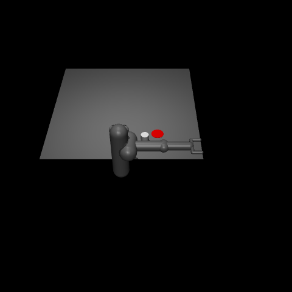 |
| Action Space | (17,) | (1,) | (1,) | (7,) |
| Observation Space| (348,) | (9,) | (4,) | (23,) |

| | [Reacher](https://gymnasium.farama.org/environments/mujoco/reacher/) | [Swimmer](https://gymnasium.farama.org/environments/mujoco/swimmer/) | [Walker2D](https://gymnasium.farama.org/environments/mujoco/walker2d/) | 
| --- | ------ | ---------------- | --------------------------------------- | 
| Visualization | 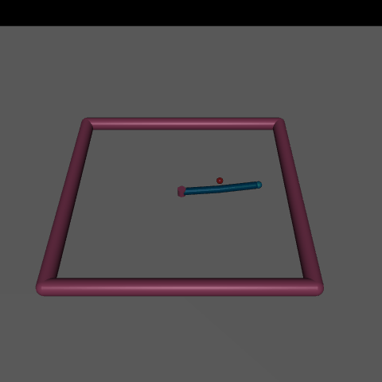 |  | |
| Action Space | (2,) | (2,) | (6,) |
| Observation Space| (10,) | (8,) | (17,) |

# Dependencies & Installation 
- Python version : 3.10.20 
- Libraries : 
    - gymnasium==1.2.3
    - gymnasium[mujoco]==1.2.3
    - pandas==2.3.3 
    - matplotlib==3.10.8
    - numpy==2.4.4
    - omegaconf==2.3.0
    - PyYAML==6.0.3
    - torch==2.11.0
    - tensorboard==2.20.0 (Optional)
    - mpi4py==4.1.1 (Optional)
- Installation: 
```bash
pip install -r requirements.txt 
```
- If you use [conda](https://docs.conda.io/projects/conda/en/latest/user-guide/install/index.html) virtual environment
```bash
conda create -n mujoco_rl python=3.10.20
conda activate mujoco_rl 
pip install -r requirements.txt 
``` 
- If you use [venv](https://docs.python.org/3/library/venv.html)  virtual environment
    - **Windows** : 
    ```bash 
    py -3.10 -m venv .venv
    .venv\Scripts\activate
    pip install -r requirements.txt
    ```
    - **Linux/MacOS**: 
    ```bash 
    python3.10 -m venv .venv
    source .venv/bin/activate
    pip install -r requirements.txt
    ```
- **Verify Setup** (Optional) : After installing the dependencies, run the following command to verify that the environment is configured correctly:
```bash 
python utils/verify_setup.py
```

# Usage 
## Train 
- Train agent on single seed 
```bash
# Example Usage
python main.py --env Hopper-v5
``` 
| Flag      | Description           | Available value | Default value | 
| --------- | ----------------------| --------------- | ------------- | 
| `--env`   | Select environments   | [Mujoco environments](https://gymnasium.farama.org/environments/mujoco/) | in [configuration file](configs/SAC.yaml) | 

- Train agent with [MPI](https://docs.open-mpi.org/en/v5.0.x/installing-open-mpi/quickstart.html) : train multiple agents with multiple seeds in parallel 
```bash 
# Example Usage
mpirun -n 4 python main.py --env Hopper-v5 
```
- `-n` : The number of processes/seeds (MPI ranks) used for parallel agent training.

## Description of Configuration Parameters 

| Parameter        | Description                             | Example Value   |
| ---------------- | --------------------------------------- | --------------- |
| `reward_scaler`  | Scaling factor applied to rewards.      | `1.0`           |
| `action_lim`     | Maximum action magnitude.               | `1.0`           |
| `memory_size`    | Replay buffer capacity.                 | `200000`        |
| `learning_start` | Steps collected before training starts. | `5000`          |
| `tau`            | Soft target update rate.                | `0.005`         |
| `gamma`          | Reward discount factor.                 | `0.99`          |
| `alpha`          | Entropy coefficient.                    | `0.2`           |
| `hidden_size_actor` | Hidden size of the actor network     | `[64, 64]`      |
| `hidden_size_critic`| Hidden size of the critic network    | `[64, 64]`      |

## Tensorboard 
- Training results can be visualized using [TensorBoard](https://docs.pytorch.org/docs/main/tensorboard.html)
```bash 
# Example Usage
tensorboard --logdir logs/tensorboard_logs/Hopper-v5/SAC_Hopper_20260408_163845/
```

- Or using TensorBoard to visualize results during traninig: 
```bash 
./utils/run_current_tensorboard.sh
```

# Results 
| [Ant](https://gymnasium.farama.org/environments/mujoco/ant/) | [HalfCheetah](https://gymnasium.farama.org/environments/mujoco/half_cheetah/) | [Hopper](https://gymnasium.farama.org/environments/mujoco/hopper/) | [Humanoid](https://gymnasium.farama.org/environments/mujoco/humanoid/) |
| ---------------- | ------------------ | --------------------------------------- | --------------- |
|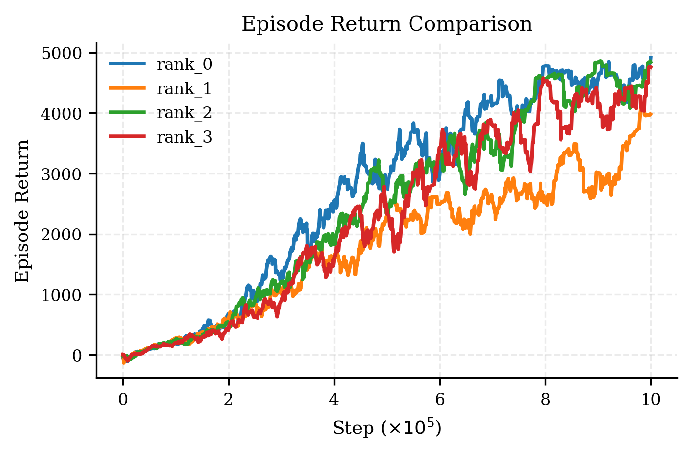 | 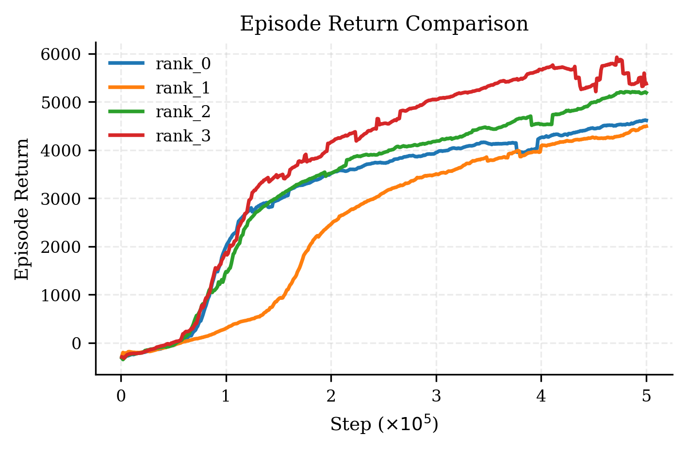 | 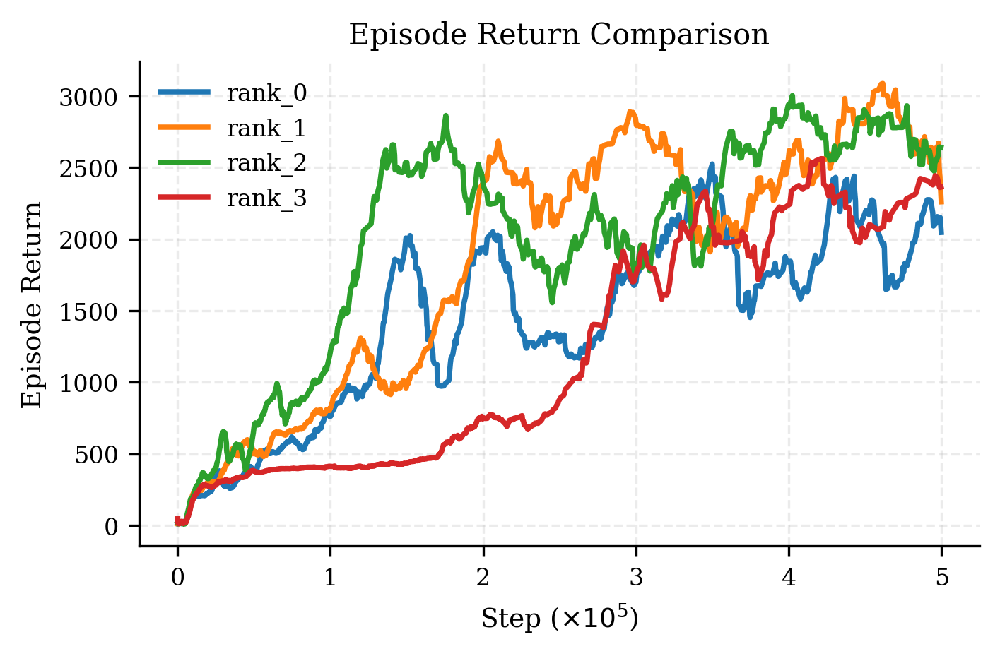|  |

| [Humanoid Standup](https://gymnasium.farama.org/environments/mujoco/humanoid_standup/) | [Inverted Double Pendulum](https://gymnasium.farama.org/environments/mujoco/inverted_double_pendulum/#) | [Inverted Pendulum](https://gymnasium.farama.org/environments/mujoco/inverted_pendulum/) | [Pusher](https://gymnasium.farama.org/environments/mujoco/pusher/) |
| ------ | ---------------- | --------------------------------------- | --------------- |
|  | 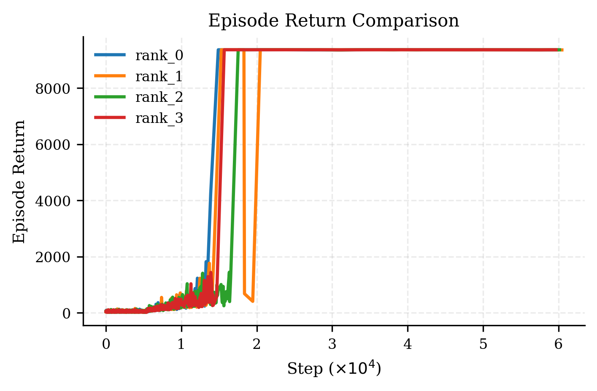 | 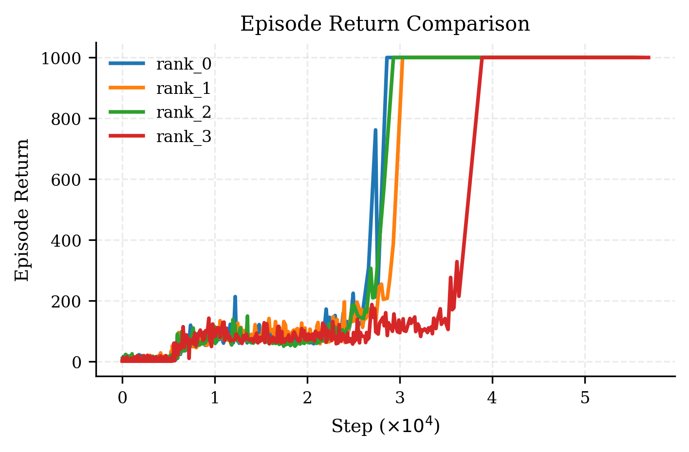| 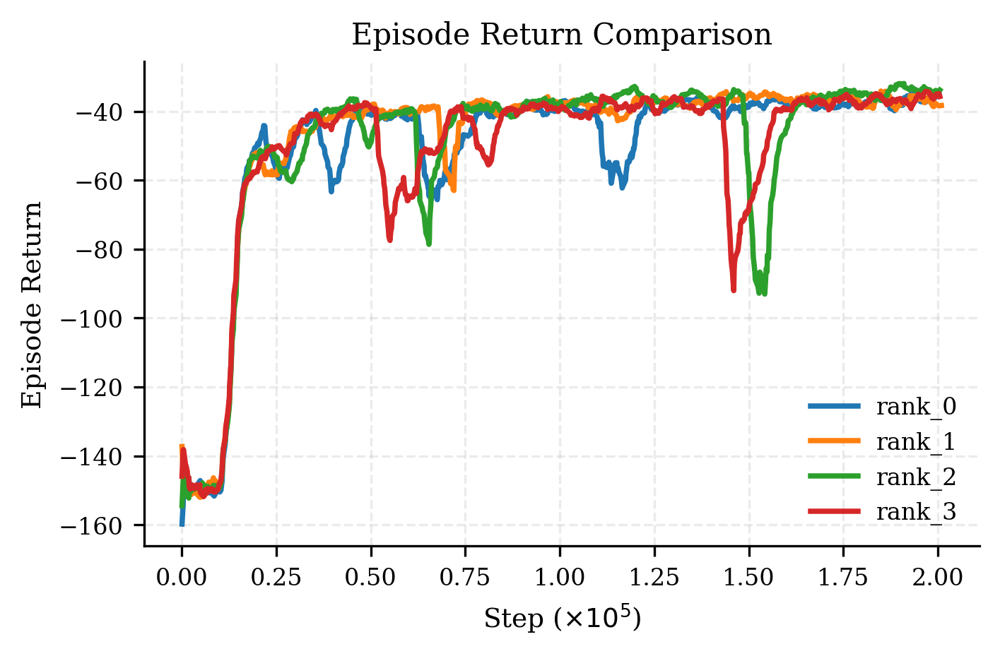 |

| [Reacher](https://gymnasium.farama.org/environments/mujoco/reacher/) | [Swimmer](https://gymnasium.farama.org/environments/mujoco/swimmer/) | [Walker2D](https://gymnasium.farama.org/environments/mujoco/walker2d/) | 
| ------ | ---------------- | --------------------------------------- | 
| 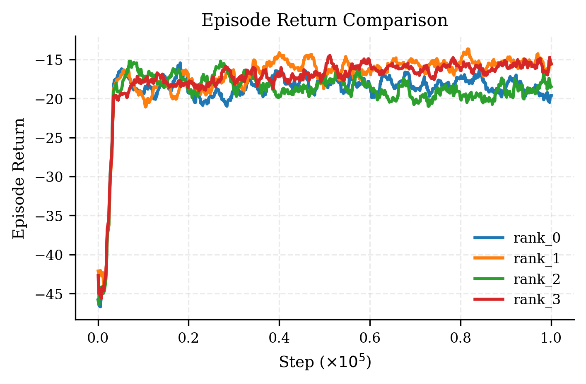 | 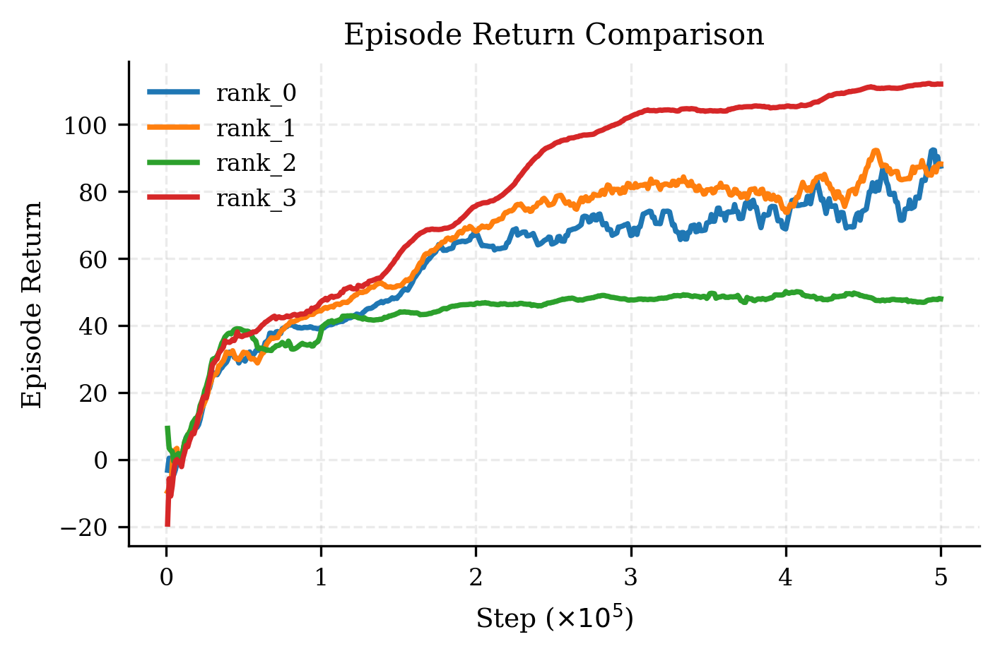 | 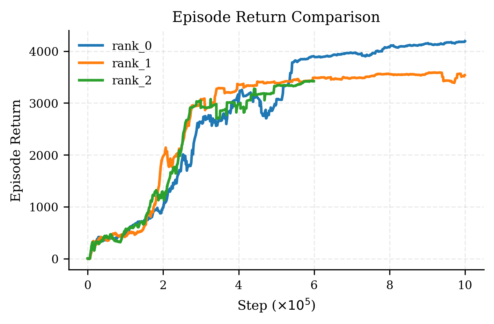|

- The configurations used to train these agents are presented in [results/configurations.md](results/configurations.md)
- Visualizations of some of these agents can be found in the [Agent Demo Results](#Agent-Demo-Results) section.

# Demonstration
## Run your own demo 
Visualize trained agent 
```bash 
# Example Usage 
# Load best agent
python utils/visualizer.py --env Hopper-v5 --runid 20260408_163845 --loadOption best
# Load final agent
python utils/visualizer.py --env Hopper-v5 --runid 20260408_163845 --loadOption final
# Load agent at checkpoint 100000
python utils/visualizer.py --env Hopper-v5 --runid 20260408_163845 --loadOption checkpoint_100000
# Load best agent from rank 0
python utils/visualizer.py --env Hopper-v5 --runid 20260408_163845 --loadOption best --rank 0
```
| Flag      | Description           | Available value | Default value | 
| --------- | --------------------- | --------------- | ------------- | 
| `--env`   | Select environments   | [Mujoco environments](https://gymnasium.farama.org/environments/mujoco/) | `Hopper-v5` | 
| `--runid` | Trained agent's run ID   | Timestamp in logs | `None` **(must be provided)** | 
| `--loadOption` | Choose Load Option  | [`best`, `final`, `checkpoint_[timestep]`] | `best` | 
| `--rank` | Choose rank   | range(`0` to `n`) based on `mpirun` | `None` | 

## Agent Demo Results
| Hopper | HalfCheetah |
| ------ | ----------------- |
 | 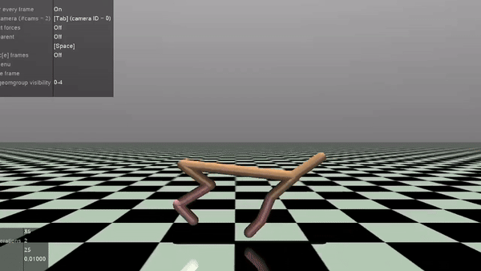 |

| Ant | Walker2D | 
| --- |--------- | 
| 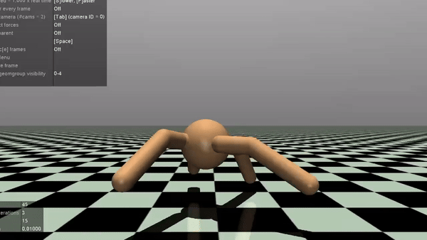 | |

| Humanoid | HumanoidStandup |
| ------ | ----------------- |
 |  |

