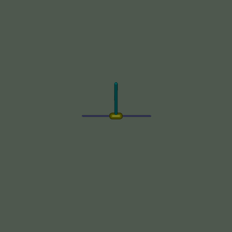
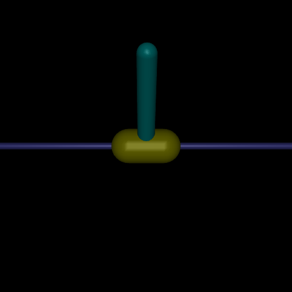

# Soft Actor Critic and Proximal Policy Optimization Implementation with PyTorch 
This repo implements the **Soft Actor-Critic** (SAC) and **Proximal Policy Optimization** (PPO) algorithms using [PyTorch](https://pytorch.org/) on **Mujoco** environments in [Gymnasium](https://gymnasium.farama.org/environments/mujoco/)

# Environments 

| | [Ant](https://gymnasium.farama.org/environments/mujoco/ant/) | [HalfCheetah](https://gymnasium.farama.org/environments/mujoco/half_cheetah/) | [Hopper](https://gymnasium.farama.org/environments/mujoco/hopper/) | [Humanoid](https://gymnasium.farama.org/environments/mujoco/humanoid/) |
| --- | ---------------- | ------------------ | --------------------------------------- | --------------- |
| Visualization | |  | |  |
| Action Space | (8,) | (6,) | (3,) | (17,) |
| Observation Space| (105,) | (17,) | (11,) | (348,) |

| | [Humanoid Standup](https://gymnasium.farama.org/environments/mujoco/humanoid_standup/) | [Inverted Double Pendulum](https://gymnasium.farama.org/environments/mujoco/inverted_double_pendulum/#) | [Inverted Pendulum](https://gymnasium.farama.org/environments/mujoco/inverted_pendulum/) | [Pusher](https://gymnasium.farama.org/environments/mujoco/pusher/) |
| --- | ------ | ---------------- | --------------------------------------- | --------------- |
| Visualization |  |  | |  |
| Action Space | (17,) | (1,) | (1,) | (7,) |
| Observation Space| (348,) | (9,) | (4,) | (23,) |

| | [Reacher](https://gymnasium.farama.org/environments/mujoco/reacher/) | [Swimmer](https://gymnasium.farama.org/environments/mujoco/swimmer/) | [Walker2D](https://gymnasium.farama.org/environments/mujoco/walker2d/) | 
| --- | ------ | ---------------- | --------------------------------------- | 
| Visualization |  |  | |
| Action Space | (2,) | (2,) | (6,) |
| Observation Space| (10,) | (8,) | (17,) |

# Dependencies & Installation 
- Python version : 3.10.20 
- Libraries : 
    - gymnasium==1.2.3
    - gymnasium[mujoco]==1.2.3
    - pandas==2.3.3 
    - matplotlib==3.10.8
    - numpy==2.4.4
    - omegaconf==2.3.0
    - PyYAML==6.0.3
    - torch==2.11.0
    - tensorboard==2.20.0 (Optional)
    - mpi4py==4.1.1 (Optional)
- Installation: 
```bash
pip install -r requirements.txt 
```
- If you use [conda](https://docs.conda.io/projects/conda/en/latest/user-guide/install/index.html) virtual environment
```bash
conda create -n mujoco_rl python=3.10.20
conda activate mujoco_rl 
pip install -r requirements.txt 
``` 
- If you use [venv](https://docs.python.org/3/library/venv.html)  virtual environment
    - **Windows** : 
    ```bash 
    py -3.10 -m venv .venv
    .venv\Scripts\activate
    pip install -r requirements.txt
    ```
    - **Linux/MacOS**: 
    ```bash 
    python3.10 -m venv .venv
    source .venv/bin/activate
    pip install -r requirements.txt
    ```
- **Verify Setup** (Optional) : After installing the dependencies, run the following command to verify that the environment is configured correctly:
```bash 
python utils/verify_setup.py
```

# Folder Organization
```
├── agents
│   ├── PPO.py
│   └── SAC.py
├── components   # <---- store all the components of SAC and PPO
│   ├── networks.py
│   └── replaybuffer.py
├── configs
│   ├── PPO.yaml
│   └── SAC.yaml
├── envs
│   ├── env.py
│   └── wrapper.py
├── logs           # <---- Logging Directory
│   ├── log
│   │   ├── SAC
│   │   │   └── Hopper-v5
│   │   │       └── SAC_Hopper-v5_20260408_170139 # <-- Run ID
│   │   │           ├── rank_0                    # <-- MPI Rank
│   │   │           ├── rank_1
│   │   │           ├── rank_2
│   │   │           └── rank_3
│   │   └── PPO 
│   └── tensorboard_logs    # <---- TensorBoard Logging
│       └── SAC
│           └── Hopper-v5
│               └── SAC_Hopper-v5_20260408_170139
│                   ├── rank_0
│                   ├── rank_1
│                   ├── rank_2
│                   └── rank_3
├── main.py
├── README.md
├── requirements.txt
├── results             # <---- save results : best model, checkpoints, last models
│   ├── best
│   ├── checkpoints
│   └── models
├── train
│   ├── train_base.py
│   ├── train_PPO.py
│   └── train_SAC.py
└── utils
    ├── helper.py
    ├── logger.py
    ├── mpi_utils.py
    ├── plotter.py
    └── verify_setup.py
```

# Usage 
## Train 
- Train agent on single seed 
```bash
# Example Usage
python main.py --agent SAC --env Hopper-v5
``` 
| Flag      | Description           | Available value | Default value | 
| --------- | ----------------------| --------------- | ------------- | 
| `--agent` | Select agent to train | [`SAC`, `PPO`]  | `SAC`         | 
| `--env`   | Select environments   | [Mujoco environments](https://gymnasium.farama.org/environments/mujoco/) | in [configuration file](configs/SAC.yaml) | 

- Train agent with [MPI](https://docs.open-mpi.org/en/v5.0.x/installing-open-mpi/quickstart.html) : train multiple agents with multiple seeds in parallel 
```bash 
# Example Usage
mpirun -n 4 python main.py --agent SAC --env Hopper-v5 
```
- `-n` : The number of processes/seeds (MPI ranks) used for parallel agent training.

## Description of Configuration Parameters 
The project supports both Soft Actor-Critic (SAC) and Proximal Policy Optimization (PPO). Some configuration parameters are shared, while others are specific to either off-policy SAC or on-policy PPO.

| Parameter             | Description                                                             |   Used In | Example Value |
| --------------------- | ----------------------------------------------------------------------- | :-------- | ------------: |
| `reward_scaler`       | Scaling factor applied to rewards.                                      |       SAC |         `1.0` |
| `action_lim`          | Maximum action magnitude used by the policy output.                     | SAC / PPO |         `1.0` |
| `memory_size`         | Replay buffer capacity.                                                 |       SAC |      `200000` |
| `learning_start`      | Number of steps collected before training starts.                       |       SAC |        `5000` |
| `tau`                 | Soft update rate for target networks.                                   |       SAC |       `0.005` |
| `gamma`               | Discount factor for future rewards.                                     | SAC / PPO |        `0.99` |
| `alpha`               | Entropy coefficient in SAC.                                             |       SAC |         `0.2` |
| `rollout_steps`       | Number of on-policy environment steps collected before each PPO update. |       PPO |        `2048` |
| `batch_size`          | Mini-batch size used during optimization.                               | SAC / PPO |          `64` |
| `gae_lambda`          | GAE smoothing factor for advantage estimation.                          |       PPO |        `0.95` |
| `clip_coef`           | PPO clipping coefficient for the policy ratio.                          |       PPO |         `0.2` |
| `ent_coef`            | Entropy bonus coefficient encouraging exploration.                      |       PPO |         `0.0` |
| `vf_coef`             | Weight of the value loss term in PPO.                                   |       PPO |         `0.5` |
| `max_grad_norm`       | Maximum gradient norm used for gradient clipping.                       |       PPO |         `0.5` |
| `update_epochs`       | Number of epochs over the same rollout data in PPO.                     |       PPO |          `10` |
| `target_kl`           | Early stopping threshold based on approximate KL divergence.            |       PPO |        `0.02` |
| `normalize_advantage` | Whether to normalize advantages before PPO updates.                     |       PPO |        `true` |
| `hidden_size_actor`   | Hidden layer sizes of the actor network.                                | SAC / PPO |    `[64, 64]` |
| `hidden_size_critic`  | Hidden layer sizes of the critic network.                               | SAC / PPO |    `[64, 64]` |
| `hidden_act`          | Hidden activation function used in the networks.                        |       PPO |        `Tanh` |
| `gradient_step`       | Number of gradient updates per training step.                           |       SAC |           `1` |
| `total_timesteps`     | Total number of environment interaction steps used for training.        | SAC / PPO |     `1000000` |
| `seed`                | Random seed for reproducibility.                                        | SAC / PPO |          `42` |
| `device`              | Device used for training.                                               | SAC / PPO |        `auto` |
| `show_tb`             | Whether to enable TensorBoard logging.                                  | SAC / PPO |        `true` |

## Tensorboard 
- Training results can be visualized using [TensorBoard](https://docs.pytorch.org/docs/main/tensorboard.html)
```bash 
# Example Usage
tensorboard --logdir logs/tensorboard_logs/SAC/Hopper-v5/SAC_Hopper_20260408_163845/
```

# Results 
| | [Ant](https://gymnasium.farama.org/environments/mujoco/ant/) | [HalfCheetah](https://gymnasium.farama.org/environments/mujoco/half_cheetah/) | [Hopper](https://gymnasium.farama.org/environments/mujoco/hopper/) | [Humanoid](https://gymnasium.farama.org/environments/mujoco/humanoid/) |
| --- | ---------------- | ------------------ | --------------------------------------- | --------------- |
| SAC | |  | |  |
| PPO | |  | |  |

| | [Humanoid Standup](https://gymnasium.farama.org/environments/mujoco/humanoid_standup/) | [Inverted Double Pendulum](https://gymnasium.farama.org/environments/mujoco/inverted_double_pendulum/#) | [Inverted Pendulum](https://gymnasium.farama.org/environments/mujoco/inverted_pendulum/) | [Pusher](https://gymnasium.farama.org/environments/mujoco/pusher/) |
| --- | ------ | ---------------- | --------------------------------------- | --------------- |
| SAC |  |  | |  |
| PPO |  |  | |  |

| | [Reacher](https://gymnasium.farama.org/environments/mujoco/reacher/) | [Swimmer](https://gymnasium.farama.org/environments/mujoco/swimmer/) | [Walker2D](https://gymnasium.farama.org/environments/mujoco/walker2d/) | 
| --- | ------ | ---------------- | --------------------------------------- | 
| SAC |  |  | |
| PPO |  |  | |

# Demonstration
- Visualize trained agent 
```bash 
# Example Usage 
# Load best agent
python utils/visualizer.py --agent SAC --env Hopper-v5 --runid 20260408_163845 --loadOption best
# Load final agent
python utils/visualizer.py --agent SAC --env Hopper-v5 --runid 20260408_163845 --loadOption final
# Load agent at checkpoint 100000
python utils/visualizer.py --agent SAC --env Hopper-v5 --runid 20260408_163845 --loadOption checkpoint_100000
```
| Flag      | Description           | Available value | Default value | 
| --------- | --------------------- | --------------- | ------------- | 
| `--agent` | Select agent to demo  | [`SAC`, `PPO`]  | `SAC`         | 
| `--env`   | Select environments   | [Mujoco environments](https://gymnasium.farama.org/environments/mujoco/) | in [configuration file](configs/SAC.yaml) | 
| `--runid` | Trained agent's run ID   | Timestamp in logs | `None` (must be provided) | 
| `--loadOption` | Choose Load Option  | [`best`, `final`, `checkpoint_[timestep]`] | `best` | 

